## Windows服务器搭建DNS服务器

> 参考地址:[https://www.jianshu.com/p/5038a95456b3](https://www.jianshu.com/p/5038a95456b3)

----

### 1、配置DNS服务器

1. 进入Window server 系统，打开**服务器管理器**，在**仪表板**里点击**添加角色和功能**。
 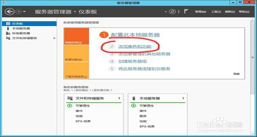

2. 进入**“添加角色和功能向导”**，检查到静态IP地址已配置完成，管理员帐户使用的是强密码和最新的安全更新在实验中可以忽略，点击**“下一步”**。
 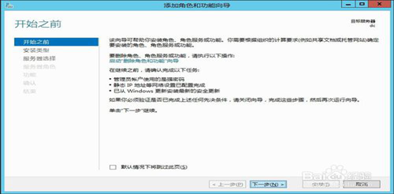

3. 我们在本地运行的物理计算机上安装，故安装类型选择第一项**“基于角色或基于功能的安装”**。
 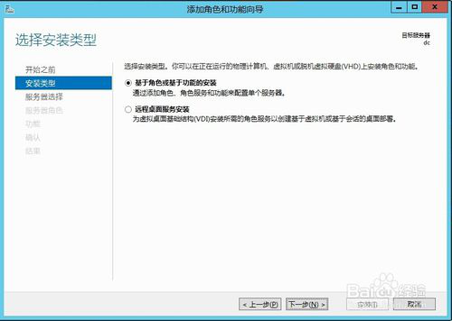

4. 服务器选择服务器池中的本地服务器**“dc”**。
 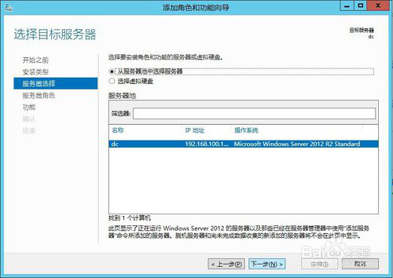

5. 服务器角色中勾选上**“DNS服务器”**，同时也在该服务器上安装DNS服务器管理工具。
 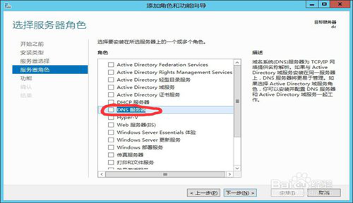

​      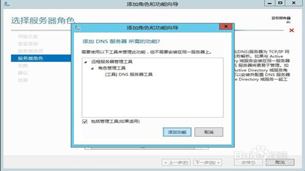

​     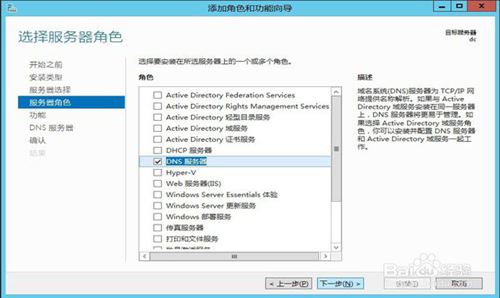

6. DNS服务器的安装不需要添加其他功能，功能安装页面直接点击**“下一步”**。
 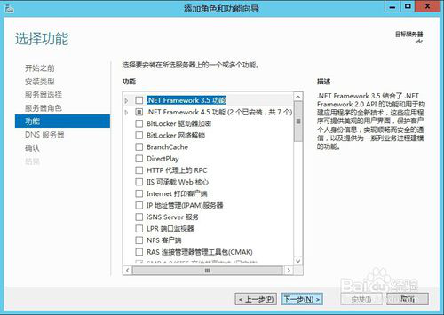

7. 注意事项中说明当DNS服务器和Active Directory域服务器集成时，DNS服务器会自动复制DNS数据及其他目录服务数据；AD域服务器上必须安装DNS服务器。点击**“下一步”**。
 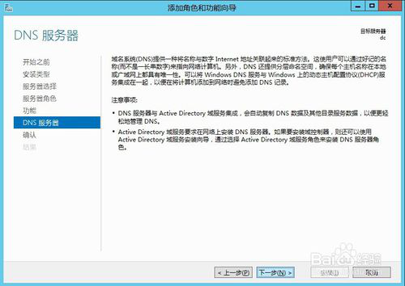

8. 确认选择无误，点击**“安装”**按钮开始安装，安装完毕关闭添加角色和功能向导。
 

**到这一步我们就将DNS服务器搭建好了，接下来我们需要配置DNS服务。**

### 2、配置DNS域名解析

1. 从**工具**打开**DNS**
 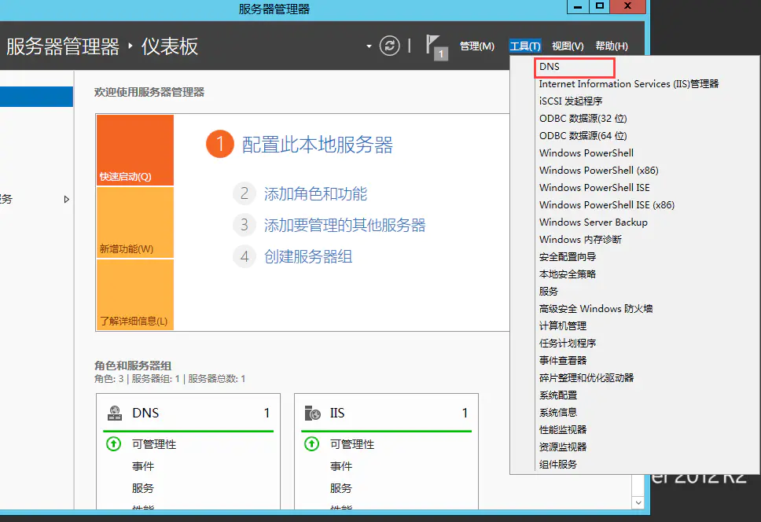

2. 在**正向查找区域**点击鼠标右键**新建区域**
 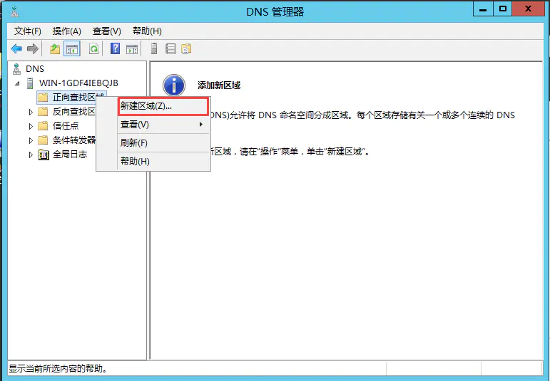

3. 根据向导完成，默认直到**区域名称**填写需要部署的域名,然后默认一直默认执行。

 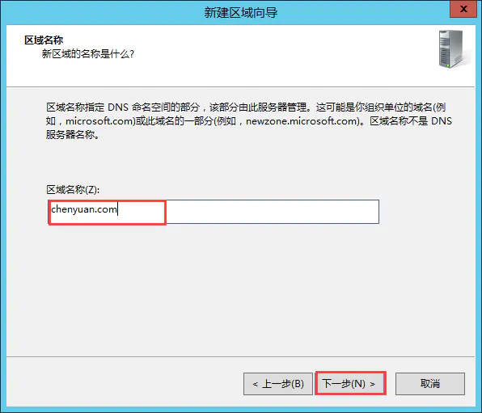

注：这里的是填写域名的。（以www.qq.com为例，qq.com才是域名）

 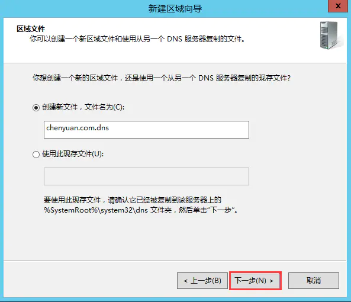

 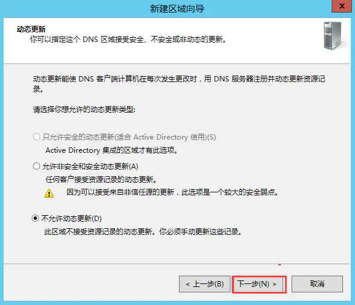

4. 在**正向查找区域**下点击我们刚才新建的**chenyuan.com**（这里新建的因人而异)
​ 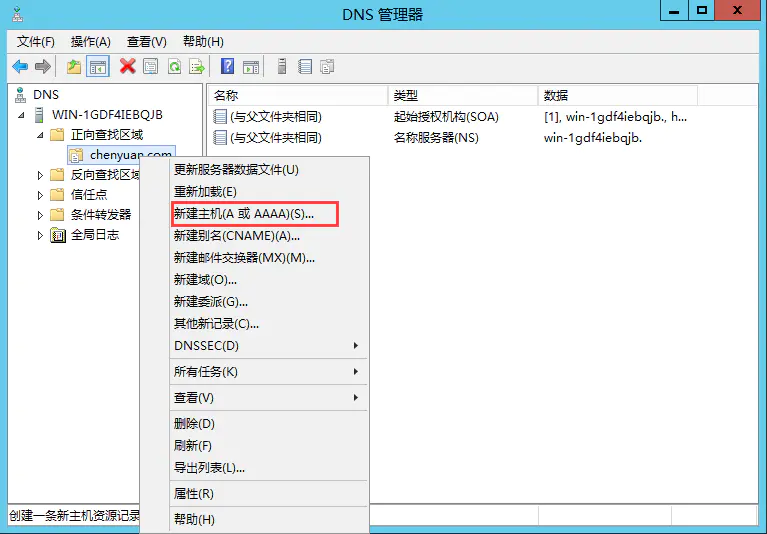
​
​ 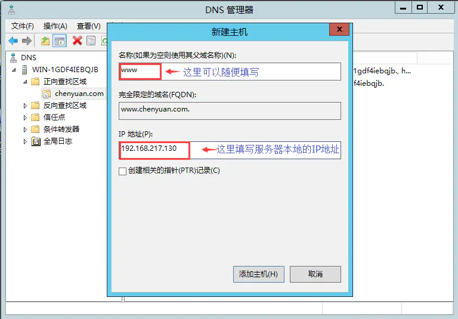
   
5. 在**反向查找区域**点击**新建区域**

 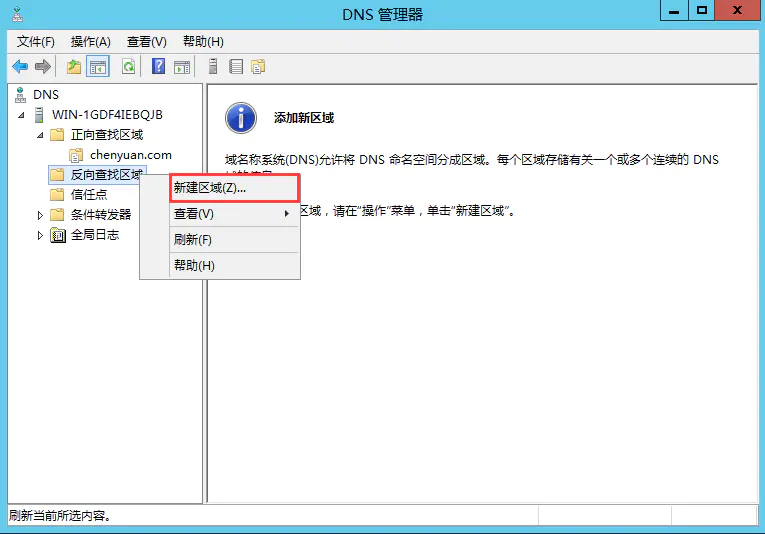

   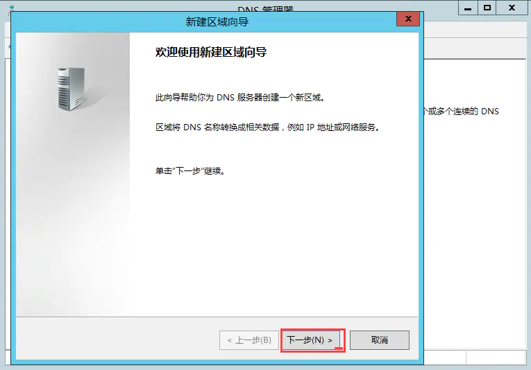

  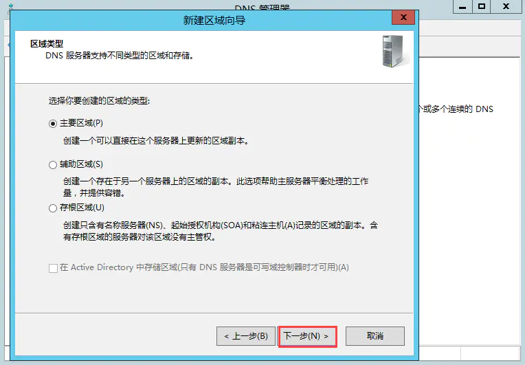

   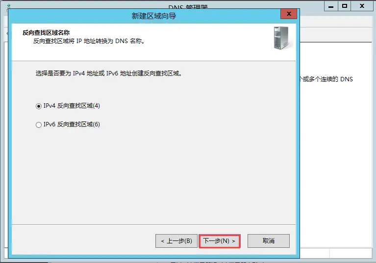

   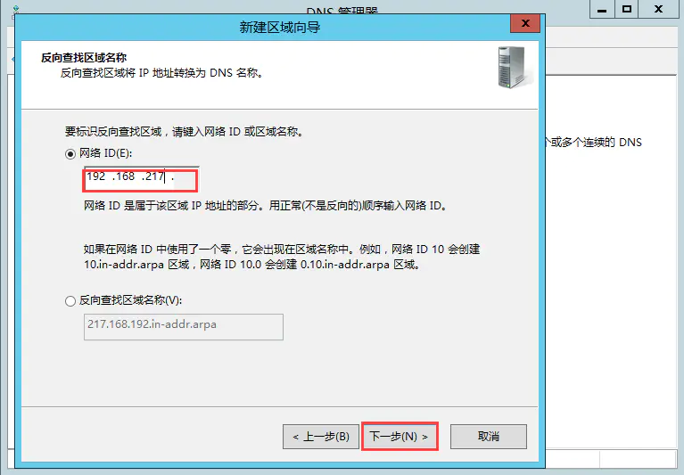

  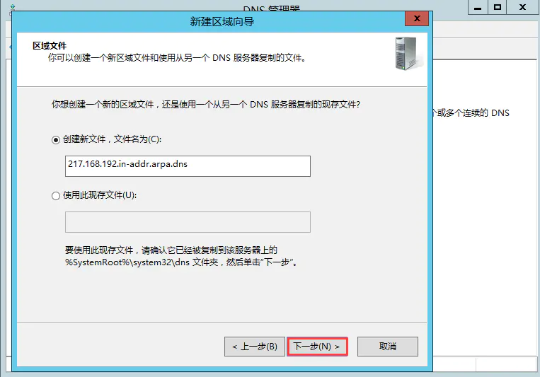

   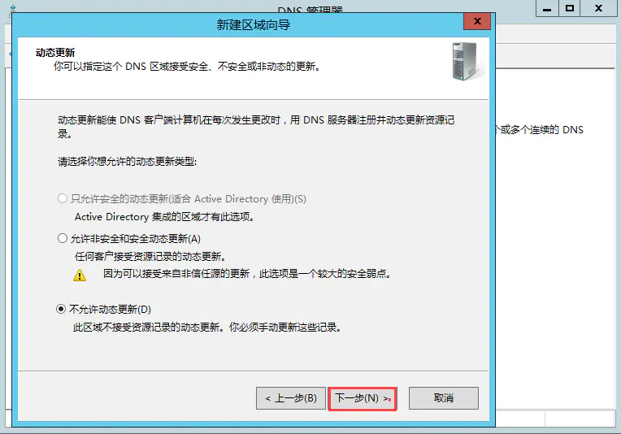

6. 在反向查找区域下点击我们新建的IP段那里，右键**新建指针**

 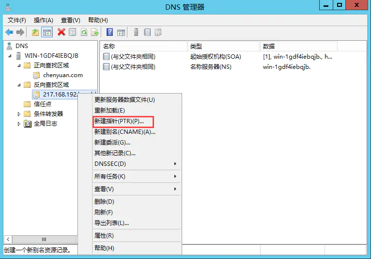

 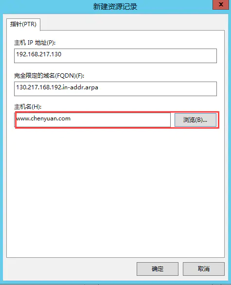

### 3、测试

1. 点击我们的DNS服务器，启动nslookup

 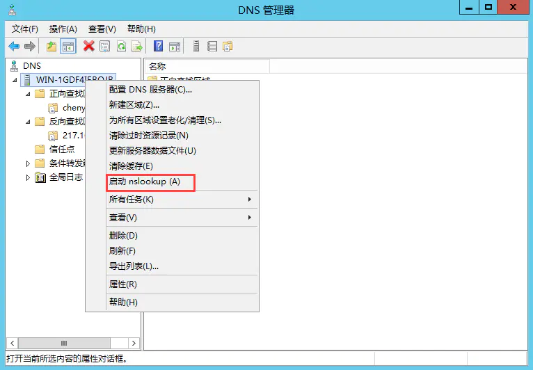

2、依次输入我们实验域名www.chenyuan.com和ip地址

 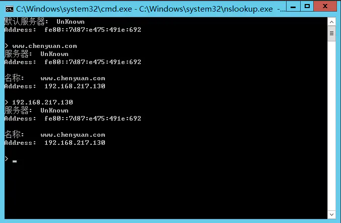

3、测试成功,DNS搭建完成

