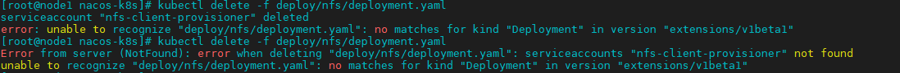

## Nacos+K8S集群部署

> 参阅[官方文档](https://nacos.io/zh-cn/docs/use-nacos-with-kubernetes.html)步骤

官方文档有两种部署方式，这里使用它的高可用方式，通过NFS持久化数据卷

------

### 1、部署NFS

#### 1.  创建角色

   ```sh
   $ kubectl create -f deploy/nfs/rbac.yaml
   ```

####  2. 创建 `ServiceAccout` 和部署  `NFS-Clinet Provisioner`

####  3. 创建 `NFS StrorageClass`

####  4. 验证NFS部署是否成功

####  5. 部署中的问题

##### 问题1、`Error from server (AlreadyExists)`

出现这个错误的原因是，之前系统已经存在执行过的实例，有两种处理方式，一种是直接删除，一种是重新更新改文件。

1. 直接删除

使用 `kubectl delete`命令删除指定的文件

```sh
$ kubectl delete -f deploy/nfs/deployment.yaml
```

2. 更新文件

当删除出现 如下错误时，则可以修改yaml文件后，重新更新替换



编辑 `deployment.yaml` 文件，修改以下位置

```yaml
-apiVersion: extensions/v1beta1
+apiVersion: apps/v1
metadata:
  name: nfs-client-provisioner
spec:
  replicas: 1
  +selector:
    +matchLabels:
      +name: nfs-client-provisioner
  strategy:
    type: Recreate
  template:
    metadata:
      labels:
        -app: nfs-client-provisioner
        +name: nfs-client-provisioner
```

保持后，通过 `kubectl apply -f` 命令更新

```sh
$ kubectl apply -f deploy/nfs/deployment.yaml
```

