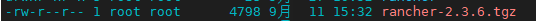

## Rancher的离线安装

> 在K3s集群上安装Rancher。Helm安装，参照[Helm3.2离线安装](Helm3.2离线安装.md)

本节分三个部分安装HA Rancher：

- [添加 Helm Chart 仓库](#1、添加 Helm Chart 仓库)
- [SSL配置](#2、SSL配置)
- [安装Rancher](#3、安装Rancher)

### 1、添加 Helm Chart 仓库

从可以访问 Internet 的系统中，获取最新的 Rancher Helm Chart，然后将内容复制到可以访问 Rancher Server 集群的系统中。

1. 使用`helm repo add`来添加仓库，不同的地址适应不同的 Rancher 版本，请替换命令中的`<CHART_REPO>`，替换为`latest`，`stable`或`alpha`。更多信息请参考[如何选择 Rancher 版本](https://docs.rancher.cn/docs/rancher2/installation/options/server-tags/_index)。

   - `latest`： 最新版，建议在尝试新功能时使用。
   - `stable`：稳定版，建议生产环境中使用。
   - `alpha`：预览版， 未来版本的实验性预览。

   ```sh
   helm repo add rancher-<CHART_REPO> https://releases.rancher.com/server-charts/<CHART_REPO>
   ```

   这里选择 `stable`稳定版。

2. 获取最新的Rancher Chart。

   ```sh
   helm fetch rancher-<CHART_REPO>/rancher
   ```

   

### 2、SSL配置

Rancher Server 在默认情况下被设计为安全的，并且需要 SSL/TLS 配置。

当在离线环境的 Kubernetes 中安装 Rancher 时，推荐两种证书生成方式。

> **注意：**如果要在外部终止 SSL/TLS，请参阅[在外部负载均衡器上终止 TLS](https://docs.rancher.cn/docs/rancher2/installation/options/chart-options/_index)。

| 设置                     | Chart 选项                   | 描述                                                         | 是否需要 cert-manager？ |
| ------------------------ | ---------------------------- | ------------------------------------------------------------ | ----------------------- |
| Rancher 生成的自签名证书 | `ingress.tls.source=rancher` | 使用 Rancher 生成的 CA 签发的自签名证书 此项为**默认选项**。在渲染 Rancher Helm 模板时不需要传递此项。 | 是                      |
| 已有的证书               | `ingress.tls.source=secret`  | 通过创建 Kubernetes Secret（s）使用您已有的证书文件。 渲染 Rancher Helm 模板时必须传递此选项。 | 否                      |

> Rancher 中国技术支持团队建议您使用“您已有的证书” `ingress.tls.source=secret` 这种方式，从而减少对 cert-manager 的运维成本。

这里使用私有证书，私有证书参考[生成自签名SSL证书](生成自签名SSL证书.md)。

设置 Rancher 模板，声明您选择的选项。使用下面表中的参考选项，需要给 Rancher 配置使用私有镜像库。

| 占位符                           | 描述                 |
| -------------------------------- | -------------------- |
| `<VERSION>`                      | Rancher 版本         |
| `<RANCHER.YOURDOMAIN.COM>`       | 负载均衡器对应的 DNS |
| `<REGISTRY.YOURDOMAIN.COM:PORT>` | 私有镜像库对应的 DNS |

```sh
   helm template rancher ./rancher-<VERSION>.tgz --output-dir . \
    --namespace cattle-system \
    --set hostname=<RANCHER.YOURDOMAIN.COM> \
    --set rancherImage=<REGISTRY.YOURDOMAIN.COM:PORT>/rancher/rancher \
    --set ingress.tls.source=secret \
    --set privateCA=true \        # 使用私有CA签名的证书
    --set systemDefaultRegistry=<REGISTRY.YOURDOMAIN.COM:PORT> \ # 自v2.2.0可用，设置默认的系统镜像仓库
    --set useBundledSystemChart=true # 自v2.3.0可用，使用内嵌的 Rancher system charts
```

### 3、安装Rancher

将以上配置完毕的内容复制到可以访问 Rancher Server 集群的系统中，准备妥当，完成最后的安装。

1. 创建`cattle-system`命名空间

   ```
   kubectl create namespace cattle-system
   ```

2. 使用`kubectl`创建`tls`类型的密文

   Kubernetes只有在`cattle-system`命名空间中，将`自签名的证书`和`对应的密钥`配置到`tls-rancher-ingress`的密文中，才会为Rancher创建所有的对象和服务。

   使用 `kubectl` 创建 `tls` 类型的密文。

   ```sh
   kubectl -n cattle-system create secret tls tls-rancher-ingress \
     --cert=tls.crt \
     --key=tls.key
   ```

3. 使用私有CA签发证书

   如果您使用的是私有 CA，Rancher 需要您提供 CA 证书的副本，用来校验 Rancher Agent 与 Server 的连接。

   拷贝 CA 证书到名为 `cacerts.pem` 的文件，使用 `kubectl` 命令在 `cattle-system` 命名空间中创建名为 `tls-ca` 的密文。

   ```sh
   kubectl -n cattle-system create secret generic tls-ca \
     --from-file=cacerts.pem=./cacerts.pem
   ```

4. 安装Rancher

   ```sh
   kubectl -n cattle-system apply -R -f ./rancher
   ```

   

