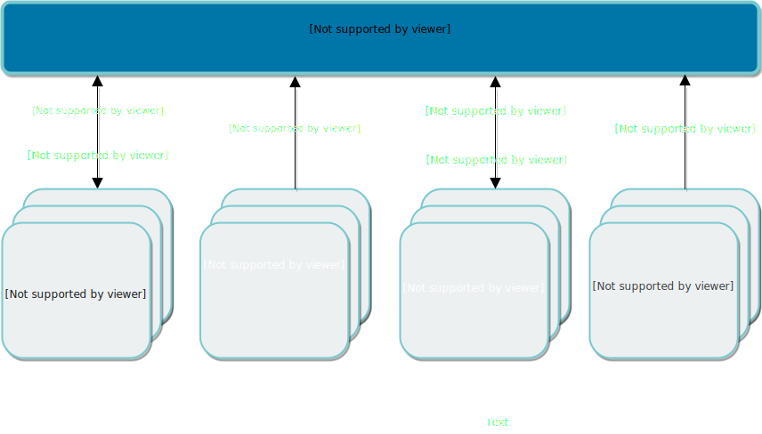
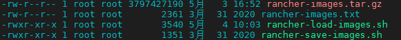

## Rancher+K3s安装环境准备

> 这里通过K3s高可用集群安装。

### (一)基础设施

> 参考[官网文档](https://docs.rancher.cn/docs/rancher2/installation/requirements/_index)

在 K3s 集群中安装 Rancher 高可用，我们建议为高可用安装配置以下基础设施：

- **2 个 Linux 节点**，通常是虚拟机，您可以自行选择的基础设施提供商，例如 Amazon EC2，阿里云，腾讯云或者 vShpere 等。
- **1 个外置数据库**，用于存储集群数据。我们建议使用 MySQL。
- **1 个负载均衡器**，用于将流量转发到这两个节点。
- **一条 DNS 记录**，用于将 URL 指向负载均衡器。这将成为 Rancher Server 的 URL，下游集群需要可以访问到这个地址。

#### 1、**配置Linux节点**

##### 1.  **操作系统和容器运行时要求**

   Rancher 应用可以兼容当前任何流行的 Linux 发行版。

   Rancher 官方支持并且已在如下操作系统中测试了 Rancher 和 RKE，它们包括 Ubuntu，CentOS，Oracle Linux，RancherOS 和 RedHat Enterprise Linux

   K3s 几乎可以在任何 Linux 版本上运行。K3s 在以下操作系统及其这些版本后续的非主要版本中进行了测试：

   - Ubuntu 16.04 (amd64)
   - Ubuntu 18.04 (amd64)
   - Raspbian Buster (armhf)

##### 2.  **安装Docker**

   可以按照[Docker 官方文档](https://docs.docker.com/)中的步骤安装 Docker。

##### 3.  **K3s高可用安装的CPU和内容要求**

| 部署规模 | 集群         | 节点           | vCPUs | 内存   | 数据库规模               |
| -------- | ------------ | -------------- | ----- | ------ | ------------------------ |
| 小       | 最多 150 个  | 最多 1500 个   | 2     | 8 GB   | 2 cores, 4GB + 1000 IOPS |
| 中       | 最多 300 个  | 最多 3000 个   | 4     | 16 GB  | 2 cores, 4GB + 1000 IOPS |
| 大       | 最多 500 个  | 最多 5000 个   | 8     | 32 GB  | 2 cores, 4GB + 1000 IOPS |
| 特大     | 最多 1000 个 | 最多 10,000 个 | 16    | 64 GB  | 2 cores, 4GB + 1000 IOPS |
| 超大     | 最多 2000 个 | 最多 20,000 个 | 32    | 128 GB | 2 cores, 4GB + 1000 IOPS |

#####  4.  **K3s高可用安装的端口要求**

   下图描述了为每种[集群类型](https://docs.rancher.cn/docs/rancher2/cluster-provisioning/_index)开放的端口。

   Rancher 管理面的端口要求

   

   下表细分了入站和出站流量的端口要求：

   Rancher 节点的入站规则

| 协议 | 端口 | 源                                                           | 描述                                   |
| ---- | ---- | ------------------------------------------------------------ | -------------------------------------- |
| TCP  | 80   | 进行外部 SSL 终止的负载均衡器/代理                           | 使用外部 SSL 终止时的 Rancher UI/API   |
| TCP  | 443  | etcd 节点controlplane 节点worker 节点托管的/导入的 Kubernetes任何需要使用 Rancher UI 或 API 的源 | Rancher Agent，Rancher UI/API，kubectl |

   Rancher 节点的出站规则

| 协议 | 端口 | 目的                                                     | 描述                                             |
| ---- | ---- | -------------------------------------------------------- | ------------------------------------------------ |
| TCP  | 22   | 使用主机驱动创建的节点中的任何节点 IP                    | 使用主机驱动通过 SSH 进行节点配置                |
| TCP  | 443  | `35.160.43.145/32`，`35.167.242.46/32`，`52.33.59.17/32` | git.rancher.io (应用商店)                        |
| TCP  | 2376 | 使用主机驱动创建的节点中的任何节点 IP                    | Docker Machine 使用的 Docker 守护进程的 TLS 端口 |
| TCP  | 6443 | 托管的/导入的 Kubernetes API                             | Kubernetes API Server                            |

> 注:由于生产环境原因,防火墙不能关闭,这里我除了上面的端口为,开启了2000-60000的端口

#### 2、**配置外部数据库**

对于高可用 K3s 安装，您将需要配置一个外部 [MySQL](https://www.mysql.com/) 数据库。我们已经针对 MySQL 5.7 版本对 K3s Kubernetes 集群进行了测试。

#### 3、**配置负载均衡器**

Rancher 需要配置一个负载均衡器，可以将流量定向到两个节点上的 Rancher 副本。这样可以在单个节点不可用时，继续保障与 Rancher 管理面的连接。

在后续步骤中配置 Kubernetes 时，K3s 工具将部署 Traefik Ingress 控制器。该控制器将侦听 worker 节点的 80 端口和 443 端口，以响应发送给特定主机名的流量。

在安装 Rancher 时（也是在后续步骤中），Rancher 系统将创建一个 Ingress 资源。该 Ingress 通知 Traefik Ingress 控制器侦听发往 Rancher 主机名的流量。Traefik Ingress 控制器在收到发往 Rancher 主机名的流量时，会将其转发到集群中正在运行的 Rancher Server Pod。

这里使用**4层负载均衡器**

**4 层负载均衡器** 是两种选择中相对简单的一种，它将 TCP 流量转发到您到节点。我们建议使用 4 层负载均衡器，将流量从 TCP / 80 端口和 TCP / 443 端口转发到 Rancher 管理面的集群节点上。集群上的 Ingress 控制器会将 HTTP 流量重定向到 HTTPS，并在 TCP / 443 端口上终止 SSL / TLS。Ingress 控制器会将流量转发到 Rancher Server Pod 的 TCP / 443 端口。

**配置NGINX负载均衡**

使用 NGINX 作为`L4`层负载均衡器(TCP)，它将请求轮训转发到后端的 Rancher server 节点。在此配置中，负载均衡器位于 Rancher server 节点的前面。负载均衡器可以是任何能够运行 NGINX 的主机。

这里将NGINX作为Dokcer容器运行，新建`nginx.conf`文件，写入下面内容

```nginx
worker_processes 4;
worker_rlimit_nofile 40000;

events {
    worker_connections 8192;
}

stream {
    upstream rancher_servers_http {
        least_conn;
        server 10.1.103.171:80 max_fails=3 fail_timeout=5s;
        server 10.1.103.172:80 max_fails=3 fail_timeout=5s;
        server 10.1.103.173:80 max_fails=3 fail_timeout=5s;
    }
    server {
        listen 80;
        proxy_pass rancher_servers_http;
    }

    upstream rancher_servers_https {
        least_conn;
        server 10.1.103.171:443 max_fails=3 fail_timeout=5s;
        server 10.1.103.172:443 max_fails=3 fail_timeout=5s;
        server 10.1.103.173:443 max_fails=3 fail_timeout=5s;
    }
    server {
        listen     443;
        proxy_pass rancher_servers_https;
    }

    upstream k3s_servers_https {
        least_conn;
        server 10.1.103.171:6443 max_fails=3 fail_timeout=5s;
        server 10.1.103.172:6443 max_fails=3 fail_timeout=5s;
        server 10.1.103.173:6443 max_fails=3 fail_timeout=5s;
    }
    server {
        listen     6443;
        proxy_pass k3s_servers_https;
    }

}

```

启动命令

```sh
$ docker run -d --restart=unless-stopped \
    -p 80:80 -p 443:443 \
    -v /etc/nginx.conf:/etc/nginx/nginx.conf \
    nginx:1.14
```

#### 4、**配置DNS记录**

参考[Window服务器搭建DNS服务器](../DNS系列/Window服务器搭建DNS服务器.md)文档，配置DNS域名解析，这里配置的域名为`rancher.agilefast.com`,域名指向上一步的负载均衡器主机。

### (二)同步镜像到私有仓库

默认情况下，Rancher中所有用于创建Kubernets集群或运行任何工具的镜像都是从Docker Hub中拉去，如： 监控、日志、告警、流水线等镜像。在离线环境下安装Rancher，需要一个私有镜像库，这个私有镜像库应该位于Rancher中的任意节点能访问的位置上。

> 注意：安装Docker私有仓库参照[Docker私有仓库](Docker私有仓库.md)，这里只描述在Linux节点下的镜像同步，其它内容，参照[官网文档](https://docs.rancher.cn/docs/rancher2/installation/other-installation-methods/air-gap/populate-private-registry/_index)。

对于仅有Linux节点的集群，按照以下步骤推送镜像到私有镜像库。

1. 查找 Rancher 版本所需要的资源
2. 将镜像保存到本地
3. 推送镜像到私有镜像库

#### 1、查找 Rancher 版本所需要的资源

1. 浏览Rancher的[版本发布页面](https://github.com/rancher/rancher/releases)，查找您想安装的 Rancher v2.x.x 版本。不要下载标记为 `rc` 或 `Pre-release` 的版本，因为它们在生产环境下是不稳定的。

2. 从发行版 **Assets** 部分下载以下文件，这些文件是离线环境下安装 Rancher 所必需的：

   | Release 文件             | 描述                                                         |
   | ------------------------ | ------------------------------------------------------------ |
   | `rancher-images.txt`     | 此文件包含安装 Rancher、创建集群和运行 Rancher 工具所需的镜像列表。 |
   | `rancher-save-images.sh` | 这个脚本会从 DockerHub 中拉取在文件`rancher-images.txt`中描述的所有镜像，并将它们保存为文件`rancher-images.tar.gz`。 |
   | `rancher-load-images.sh` | 这个脚本会载入文件`rancher-images.tar.gz`中的镜像，并将它们推送到您自己的私有镜 |

   这里安装的是Rancher 2.3.6版本。

#### 2、将镜像保存到本地

1. 为`rancher-save-images.sh` 文件添加可执行权限：

   ```sh
   chmod +x rancher-save-images.sh
   ```

2. 执行脚本`rancher-save-images.sh`并以`--image-list ./rancher-images.txt` 作为参数，创建所有需要镜像的压缩包：

   ```sh
   ./rancher-save-images.sh --image-list ./rancher-images.txt
   ```

   > **结果：** Docker 会开始拉取用于离线安装所需的镜像。这个过程会花费几分钟时间。完成时，您的当前目录会输出名为`rancher-images.tar.gz`的压缩包。请确认输出文件是否存在。

   

#### 3、推送镜像到私有镜像库

1. 为 `rancher-load-images.sh` 添加可执行权限：

   ```sh
   chmod +x rancher-load-images.sh
   ```

2. 使用脚本 `rancher-load-images.sh`提取`rancher-images.tar.gz`文件中的镜像，根据文件`rancher-images.txt`中的镜像列表对提取的镜像文件重新打 tag 并推送到您的私有镜像库：

   ```sh
   ./rancher-load-images.sh --image-list ./rancher-images.txt --registry <REGISTRY.YOURDOMAIN.COM:PORT>
   ```

   