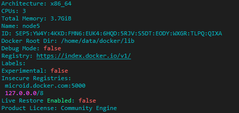

## Docker磁盘空间管理

> docker在服务器运行一段时间后，容器的缓存会导致系统存储空间占用严重。一般可以用 `du -hx --max-depth=1`命令确定大文件位置。

Docker磁盘空间占用磁盘空间大，通过下面方法解决优化。

- Docker数据的迁移
- Docker占用的磁盘空间清理

### 1、Docker数据的迁移

1. 在安装docker环境后，第一时间修改docker的默认存储位置

2. 做数据迁移，转移到内存更大的磁盘中

**操作步骤**

1. 停止docker服务

   ```sh
   $ systemctl stop docker
   ```

2. 在内存大的磁盘下新建一个docker的存储目录，可以通过`df -h` 查看那个磁盘目录的内存大，这里我在home目录下创建`mkdir -p /home/data/docker/lib`

3. 迁移`/var/lib/docker`文件下的内容到`/home/data/docker/lib`

   ```sh
   $ rsync -avz /var/lib/docker/  /home/data/docker/lib
   ```

4. 配置 `/etc/systemd/system/docker.service.d/devicemapper.conf` ,添加下面内容

   ```tex
   [Service]
   ExecStart=
   ExecStart=/usr/bin/dockerd  --graph=/home/data/docker/lib
   ```

5. 重启docker

   ```sh
   $ systemctl daemon-reload
   $ systemctl restart docker
   $ systemctl enable docker
   ```

6. 确定配置是否生效 `docker info`

   

### 2、Docker占用的磁盘空间清理

1. **`docker system` 命令**

   通过 `docker system df` 命令，类似于Linux上的df命令，用于查看Docker的磁盘使用情况

   ```sh
   [root@node1 ~]# docker system df
   TYPE                TOTAL               ACTIVE              SIZE                RECLAIMABLE
   Images              64                  30                  11.66GB             6.431GB (55%)
   Containers          85                  65                  1.334GB             451.9MB (33%)
   Local Volumes       25                  18                  20.27GB             103.7kB (0%)
   Build Cache         0                   0                   0B                  0B
   ```

   可以看到Docker 镜像占用了11.66GB，可回收6.43GB，Docker 容器占用1.33GB，可回收451.9MB

   **`docker system prune`命令** ：用于清理磁盘，删除关闭的容器、无用的数据卷和网络，以及删除`dangling`镜像（无tag的镜像）

   **`docker system prune -a`命令**：清除的更加彻底，可以将没有容器使用的镜像都删除

   ```sh
   [root@node1 ~]# docker system prune -a
   WARNING! This will remove:
     - all stopped containers
     - all networks not used by at least one container
     - all images without at least one container associated to them
     - all build cache
   
   Are you sure you want to continue? [y/N] y
   Deleted Containers:
   ......
   Total reclaimed space: 5.606GB
   [root@node1 ~]# docker system df
   TYPE                TOTAL               ACTIVE              SIZE                RECLAIMABLE
   Images              30                  30                  6.549GB             654.4MB (9%)
   Containers          70                  65                  891.9MB             782.9kB (0%)
   Local Volumes       25                  12                  20.27GB             103.7kB (0%)
   Build Cache         0    
   
   ```

2. **手动清理Docker镜像/容器/数据卷**

   删除所有关闭的容器：`docker container prune`

   删除所有dangling镜像：`docker rmi $(docker images --filter "dangling=true" -q)`

   删除所有dangling数据卷：`docker volume rm $(docker volume ls -qf dangling=true)`

3. **限制容器日志的大小**

   查看docker中日志的大小，一般在Linux系统下，docker容器日志一般在`/var/lib/docker/containers/container_id/`下面，但是如果docker做过数据迁移，必须以迁移的那个路径为标准。通过下边命令查看日志文件的大小

   ```sh
   $ du -h --max-depth=1 *  #可以查看当前目录下各文件、文件夹的大小。
   $ du -h --max-depth=0 *  #可以只显示直接子目录文件及文件夹大小统计值。
   $ du –sh #查看指定目录的总大小。
   ```

   可以通过`cat /dev/null >`  进行清空，不是`rm`

   ```sh
   $ cat /dev/null > /var/lib/docker/containers/容器id/容器id-json.log
   ```

   这种方法治标不治本，过一段时间，日志文件还是会继续增大，所以可以通过设置Docker容器日志的大小，有以下两种方法：

   - 设置一个容器的日志大小上限
   - 全局设置

   #### 1、设置一个容器的日志大小上限

   通过配置容器的`docker-compose.yml`的`max-size`选项实现：

   ```yml
   nginx: 
     image: nginx:1.12.1 
     restart: always 
     logging: 
       driver: "json-file"
       options: 
         max-size: "5g"
   ```

   #### 2、全局设置

   在`/etc/docker/daemon.json`文件中添加下面内容

   ```sh
    $ vim /etc/docker/daemon.json
    {
       "log-driver":"json-file",
       "log-opts": {"max-size":"500m", "max-file":"3"}
    }
   ```

   max-size=500m，意味着一个容器日志大小上限是500M，

   max-file=3，意味着一个容器有三个日志，分别是id+.json、id+1.json、id+2.json

   完成后，重启docker

   ```sh
   $ systemctl daemon-reload
   $ systemcl restart docker
   ```

   > 注意：设置后,只对新添加的容器有效。

