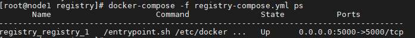

## 私有仓库

> 像Docker Hub这样的公共库对于公司使用来说可能有很多的不安全因素，所有这里记录说明 `docker-registry` 私有仓库的搭建

### 1、获取 docker-registry

获取官方`registry`镜像

```sh
$ docker pull registry
```

### 2、配置docker-registry的地址

如果要让内网地址下的其它主机能够访问私有仓库，需要为docker-registry配置内网地址，同时取消在`https`的显示，因为，docker默认不允许非`HTTPS` 方式推送镜像。

在 `/etc/docker/daemon.json` 文件中写入以下内容（如果文件不存在，创建文件）

```json
{
  "registry-mirror": [
    "https://hub-mirror.c.163.com",
    "https://mirror.baidubce.com"
  ],
  "insecure-registries": [
    "192.168.199.100:5000"
  ]
}
```

> 注意：该文件必须符合 `json` 规范，负责Docker无法启动

### 3、重启docker服务

```sh
$ systemctl daemon-reload
$ systemctl restart docker
```

### 4、通过docker-compse启动registry

创建`registry-compose.yml`文件，写入以下内容

```yaml
version: '3'

services:
  registry:
    restart: always 
    image: registry:latest
    ports:
      - "5000:5000"
    volumes:
      - registry-data:/var/lib/registry

volumes:
  registry-data: # 创建registry的数据卷

```

启动registry

```sh
$ docker-compose -f registry-compose.yml up -d
```

查看启动的镜像容器

```sh
$ docker-compose -f registry-compose.yml ps
```



### 5、在私有仓库上传、搜索、下载镜像

1. 通过`docker tag`来标记镜像。

2. 格式为 `docker tag IMAGE[:TAG] [REGISTRY_HOST[:REGISTRY_PORT]/]REPOSITORY[:TAG]`。

3. 通过 `docker push` 推送上传标记的镜像到私有仓库。

```sh
# 通过docker tag标记镜像
$ docker tag nacos/nacos-server:latest 192.168.199.100:5000/nacos/nacos-server:latest 
# 通过docker push 上传标记的镜像
$ docker push 192.168.199.100:5000/nacos/nacos-server:latest 
```

4. 用 `curl` 查看仓库中的镜像 格式为 `curl <仓库地址>/v2/_catalog`

```sh
$ curl 192.168.199.100:5000/v2/_catalog
{"repositories":["nacos/nacos-server"]}
```

5. 查询镜像的tag（版本）格式为 ` curl <仓库地址>/v2/<镜像名>/tags/list`

```sh
$ curl 192.168.199.100:5000/v2/nacos/nacos-server/tags/list
{"name":"nacos/nacos-server","tags":["latest"]}
```

6. 下载镜像

```sh
$ docker pull 192.168.199.100:5000/nacos/nacos-server:latest 
```

7. 删除镜像API

首先获取镜像的`digest_hash` 格式为 ` curl <仓库地址>/v2/<镜像名>/manifests/<tag> \ --header "Accept: application/vnd.docker.distribution.manifest.v2+json"`

然后通过删除镜像API 格式为 `curl -I -X DELETE "<仓库地址>/v2/<镜像名>/manifests/<镜像digest_hash>"` 执行删除操作

