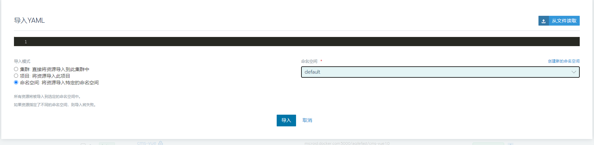
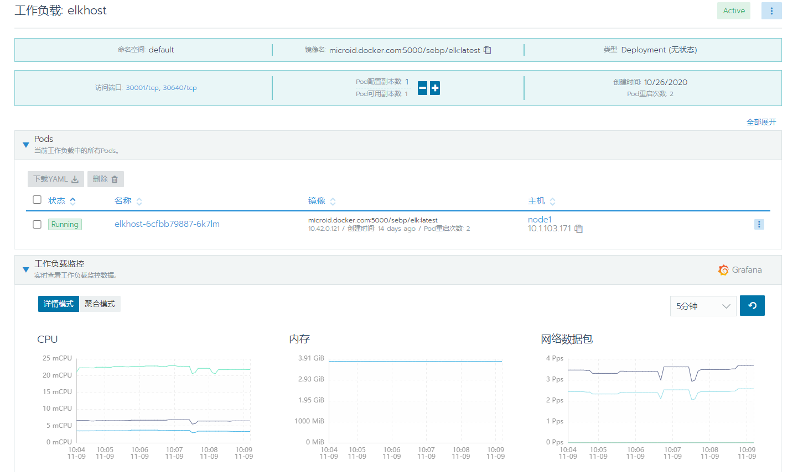
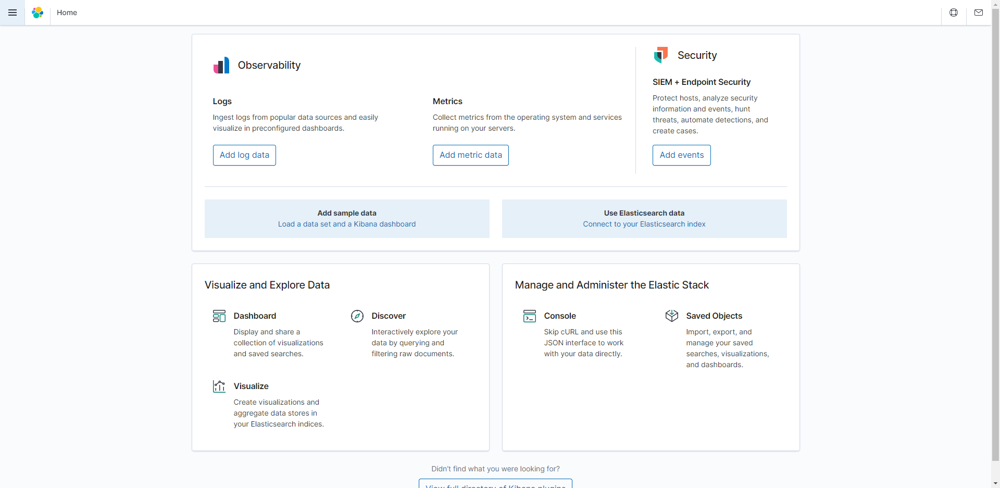
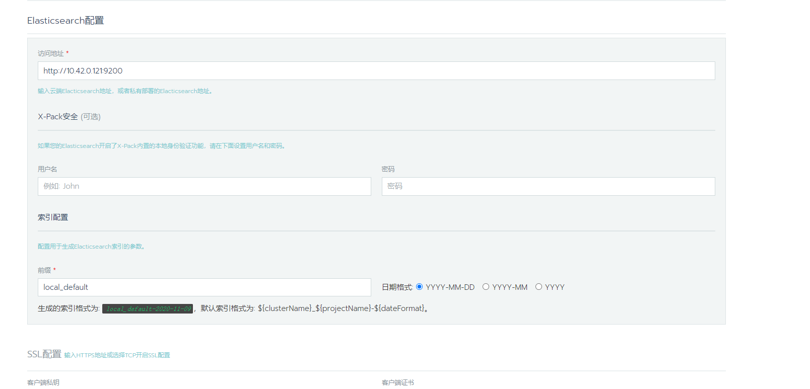
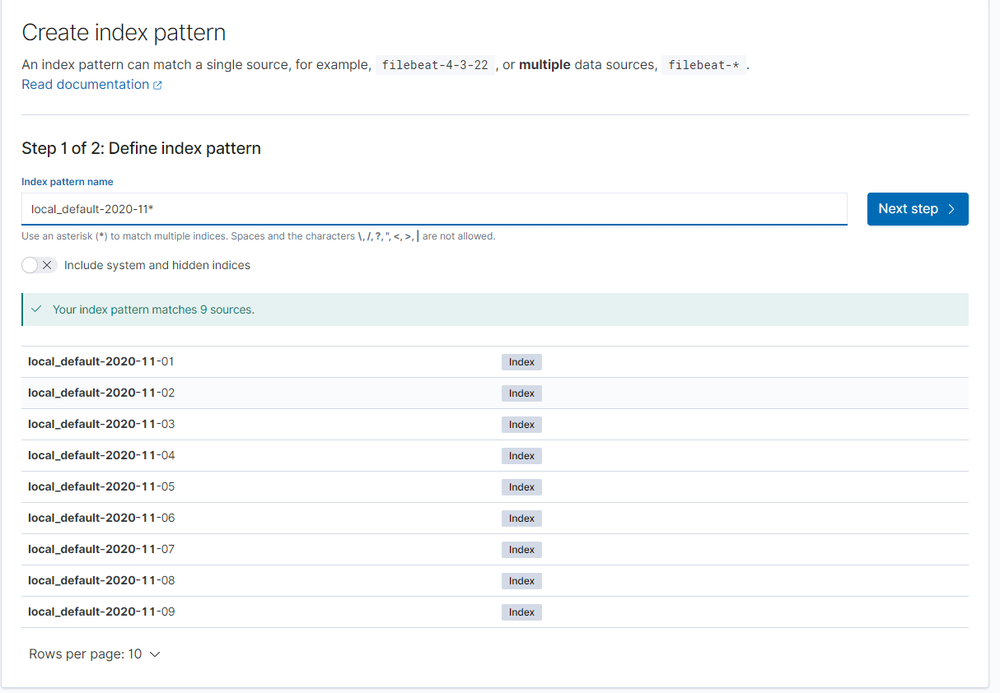
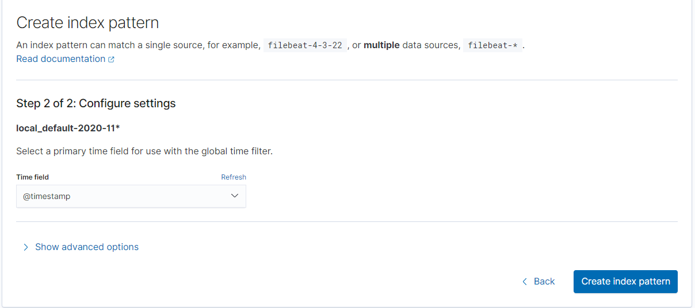
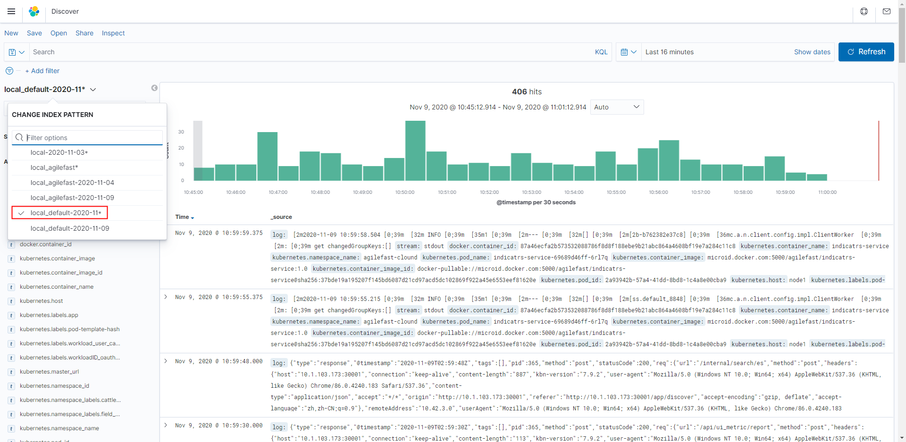
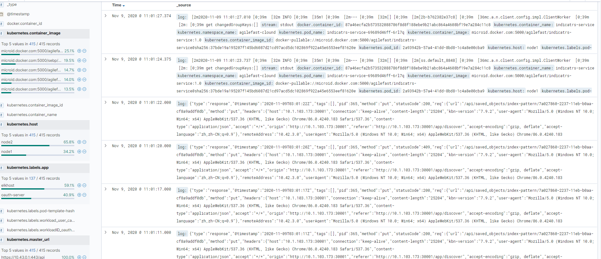

## Rancher 整合EFK

在Rancher集群中，Rancher本身使用`fluentd`从每个容器收集`stdout/stderr`日志，将每个主机上的pod日志存储在`/var/log/containers`下面，这里我们将使用`fluentd`发送到`Elasticsearch`中。

### 1、创建 `elasticsearch.yaml` 文件

```yaml
apiVersion: apps/v1
kind: Deployment
metadata:
  name: elkhost
spec:
  selector:
    matchLabels:
      app: elkhost
  replicas: 1
  template:
    metadata:
     labels:
       app: elkhost
    spec:
     containers:
     - name: elkhost
       image: microid.docker.com:5000/sebp/elk:latest
       tty: true
       ports: 
       - containerPort: 9200
       - containerPort: 5601
       - containerPort: 5044
---
apiVersion: v1
kind: Service
metadata:
  name: elk-kibana
spec:
  type: NodePort
  ports:
  - port: 5601
    nodePort: 30001
  selector:
    app: elkhost
```

### 2、使用Rancher导入`elasticsearch.yaml`文件

> 注意：这里熟悉K8s命令的话，可以直接使用命令`kublectl create -f elasticsearch.yaml -n default`创建



可以直接将`elasticsearch.yaml`文件的内容复制出来到编辑处，也可以选择从文件读取，完成后，导入模式选择`命名空间`,然后指定命名空间`default`，完成后，执行 导入操作，导入完成后，即可看到`elkhost`实例。



### 3、访问Kibana

访问地址：http://10.1.103.171:30001



### 4、Rancher配置Elasticsearch

在工具->日志界面，填写elasticsearch的地址（注意：这里没有使用https），填写索引前缀，然后测试，成功说明Rancher连接Elasticsearch成功，保存。



**注意：** 这里如果对docker做过数据迁移，如果不修改Rancher的fluentd的配置，那么elasticsearch会收不到Rancher集群的日志，fluentd 出现`unreadable. It is excluded and would be examined next time.`错误。

修改fluentd的数据卷映射，在集群`system下的cattle-logging`命名空间下找到`rancher-logging-fluentd-linux` pod实例，对实例进行升级操作，选择主容器`rancher-logging-fluentd`

修改 `dockerroot`卷的路径为docker实际路径


### 5、使用Kibana连接 Elasticsearch索引

创建索引模式，可以创`多个数据源`模式，按照月进行进行分析



选择一个时间字段和全局时间过滤器一起使用，然后执行创建



完成后，可在`Discover`模块选择刚刚创建的索引模式，即可看到日志数据信息



