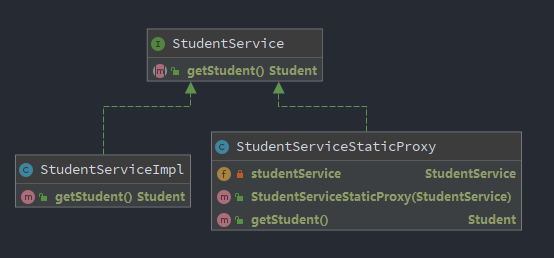

https://www.zhihu.com/question/20794107

**代理模式（Proxy）**：是通过代理对象访问目标对象，这样可以在目标对象基础上增强额外的功能，如添加权限，访问控制和日志记录等功能。

在Java中，代理分为 **静态代理** 和 **动态代理**

### 静态代理

静态代理的具体做法就是，为每个需要代理的接口类编写代理对象

定义一个**StudentService**，通过静态代理访问**StudetntServiceImpl**,类结构图如下所示

   

测试类如下

```Java
package com.Bernie.proxy;

import com.Bernie.proxy.impl.StudentServiceImpl;
import com.Bernie.proxy.impl.StudentServiceStaticProxy;
import org.junit.Test;

import java.lang.reflect.*;

public class TestProxyMain {

    @Test
    public void staticProxy() {
        StudentService studentService = new StudentServiceImpl();
        StudentServiceStaticProxy studentServiceStaticProxy = new StudentServiceStaticProxy(studentService);
        studentServiceStaticProxy.getStudent();
    }
}

```

输出：

```text
---------------------------
使用静态代理
---------------------------
判断是否有权限获取学生信息！
Student{name='Bernie', age=25}
记录获取的学生信息相关操作！
---------------------------
使用静态代理,结束
---------------------------
```

> 静态代理模式在不改变目标对象的前提下，实现了对目标对象的功能扩展。
> 不足：静态代理实现了目标对象的所有方法，一旦目标接口增加方法，代理对象和目标对象都要进行相应的修改，增加维护成本。

### 动态代理