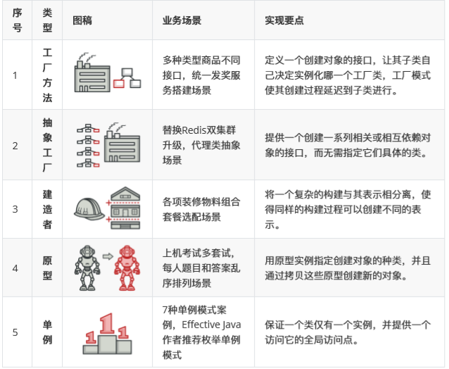
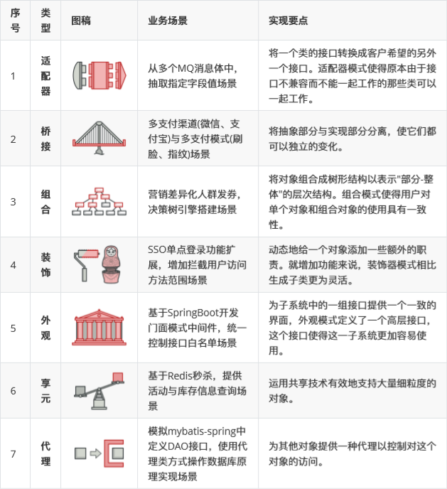
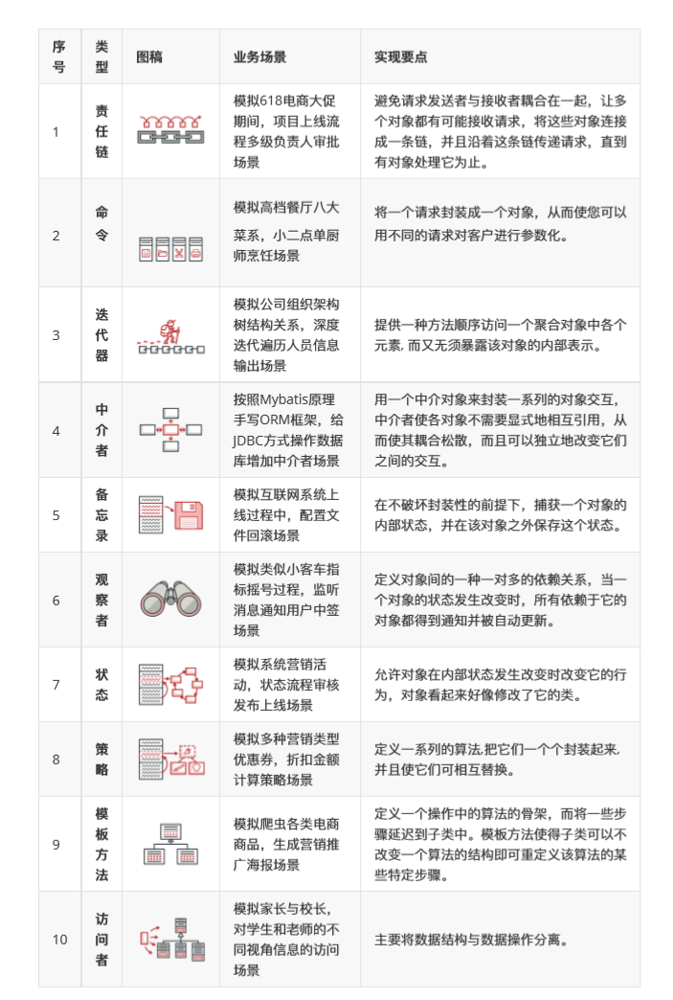

设计模式的原则

1. 单一职责：一个类和一个方法只做一件事
2. 里氏替换：多态、子类可以扩展父类
3. 依赖倒置：细节依赖抽象，下层依赖上层
4. 接口隔离：建立单一接口
5. 迪米特原则：最少知道，降低耦合
6. 开闭原则：抽象架构，扩展实现

设计模式总体分为三种类型：

### 一、创建型模式

> 这里模式提供创建对象的机制，能够提升已有代码的灵活性和可复用性。

### 二、结构型模式

> 这类模式结束如何将对象和类组成较大的结构，并同时保持结构的灵活和高效。

### 三、行为模式

> 这类模式负责对象间的高效沟通和职责委派。

