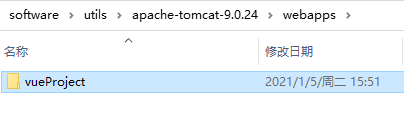
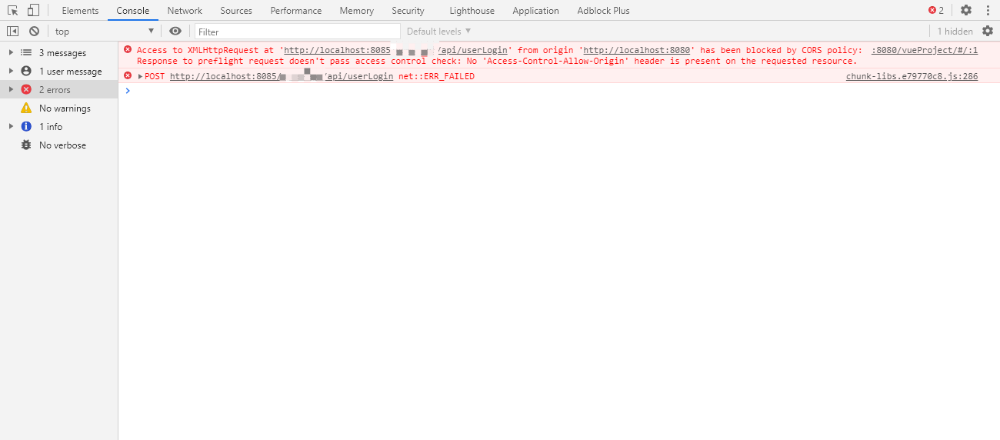

> 一般情况下，我们部署Vue打包的项目是通过nginx做一个代理转发，但是有的客户会要求同tomcat一起部署，这里记录了在Tomcat下部署前端出现的一系列问题。

### 1、修改`axios`中的`baseURL`

在vue项目中，我们访问后端接口是通过配置`proxy`的模式

```js
devServer: {
    port,
    overlay: false,
    proxy: {
      // detail: https://cli.vuejs.org/config/#devserver-proxy
      '/api': {
        target: `http://localhost:8080`, // 后端接口
        changeOrigin: true,
        pathRewrite: {
          '^/api': '/api'
        }
      }
    }
  }
```

使用tomcat部署时，没有直接通过代理的方式，所以现需要修改封装的`axios`

```js
// create an axios instance
const service = axios.create({
  baseURL: 'http://localhost:8080', // 直接配置后端接口服务的地址
  timeout: 50000 // request timeout
})
```

这里还有一种情况，就是在有的前后端分离项目中，可能存在多个后端服务，而服务请求没有经过网关，在vue中就需要配置多个`baseURL`,这里的做法是动态重写`axios`对象的`baseURL`

```js
// create an axios instance
const service = axios.create({
  baseURL: process.env.VUE_APP_BASE_API, // url = base url + request url
  timeout: 50000 // request timeout
})

// request interceptor
service.interceptors.request.use(
  config => {
    // do something before request is sent
    // 如果是生产环境，执行下面代码  
    if (process.env.NODE_ENV === 'production') {
      if (config.url.indexOf('/api') > -1) { // 根据请求的接口URL判断是哪个服务的地址，然后重写 baseURL
        config.baseURL = 'http://localhost:8080' // 这个是以api开头的服务地址
      } else {
        config.baseURL = 'http://localhost:8081' // 这个是另一个服务地址
      }
    }
    return config
  },
  error =>
    // do something with request error
    // eslint-disable-next-line implicit-arrow-linebreak
    Promise.reject(error)
)
```

配置完成后在Tomcat的webapp目录下新建一个文件夹，将打包好的vue项目拷贝进去

   

启动Tomcat，访问`http://localhost:8080/vueProject/`,这里可以看到静态页面已经可以访问，但是当发送一个后端请求，会出现如下错误



出现跨域问题

### 2、解决方案

#### 2.1 `Cors` 是什么？

> `CORS`全称为`Cross Origin Resource Sharing`（跨域资源共享）, 每一个页面需要返回一个名为`Access-Control-Allow-Origin`的http头来允许外域的站点访问，你可以仅仅暴露有限的资源和有限的外域站点访问。

我们可以理解为：如果一个请求需要允许跨域访问，则需要在`http`头中设置`Access-Control-Allow-Origin`来决定需要允许哪些站点来访问。如假设需要允许[https://www.dustyblog.c](https://www.dustyblog.cn/)这个站点的请求跨域，则可以设置：

```tex
Access-Control-Allow-Origin:https://www.dustyblog.cn。
```

这里的配置是在后端服务处配置，有两种解决方案

#### 2.2局部配置——通过`@CrossOrigin`注解配置

> 通过`CrossOrigin`注解，在`Controller`类上表明该类下所有接口都允许跨域，也可以指定允许访问的域列表

```java
@RequestMapping("/api")
@CrossOrigin
public class ApiUserController extends AbstractController {}
// 指定域
@RequestMapping("/api")
@CrossOrigin("https://www.dustyblog.cn")
public class ApiUserController extends AbstractController {}
// 或多个域
@RequestMapping("/api")
@CrossOrigin(origins = { "https://www.dustyblog.cn", "https://www.bsblog.cn" })
public class ApiUserController extends AbstractController {}
```

#### 2.3 全局配置——`WebMvcConfigurer`

重写`WebMvcConfigurer`的`addCorsMappings`方法

> 由于这里前端部署后，所有接口都会出现跨域，所以这里通过全局配置。

```java
@Configuration
@ConditionalOnClass(SpringfoxWebMvcConfiguration.class)
public class WebMvcConfig implements WebMvcConfigurer {
    @Override
    public void addCorsMappings(CorsRegistry registry) {
        registry.addMapping("/**").
                allowedOrigins("*"). //允许跨域的域名，可以用*表示允许任何域名使用
                allowedMethods("*"). //允许任何方法（post、get等）
                allowedHeaders("*"). //允许任何请求头
                allowCredentials(true). //带上cookie信息
                exposedHeaders("*").maxAge(3600L); //maxAge(3600)表明在3600秒内，不需要再发送预检验请求，可以缓存该结果
    }
}
```

> 注意：浏览器在检验请求是不是允许跨域，首先会发送一个方法为`OPTIONS`的请求，去判断是允许，这里如果在后端通过获取请求头`header`里的数据，会获取不到，所以需要对`OPTIONS`的请求方法需要放行。这里在拦截适配器处放行。

```Java
@Component
public class AuthorizationInterceptor extends HandlerInterceptorAdapter {
  
    @Override
    public boolean preHandle(HttpServletRequest request, HttpServletResponse response, Object handler) throws Exception {
       
        //解决跨域问题，放行 options 的请求
        if ("OPTIONS".equals(request.getMethod())) {
            return true;
        }
	    // do something....
        return true;
    }
}

```

