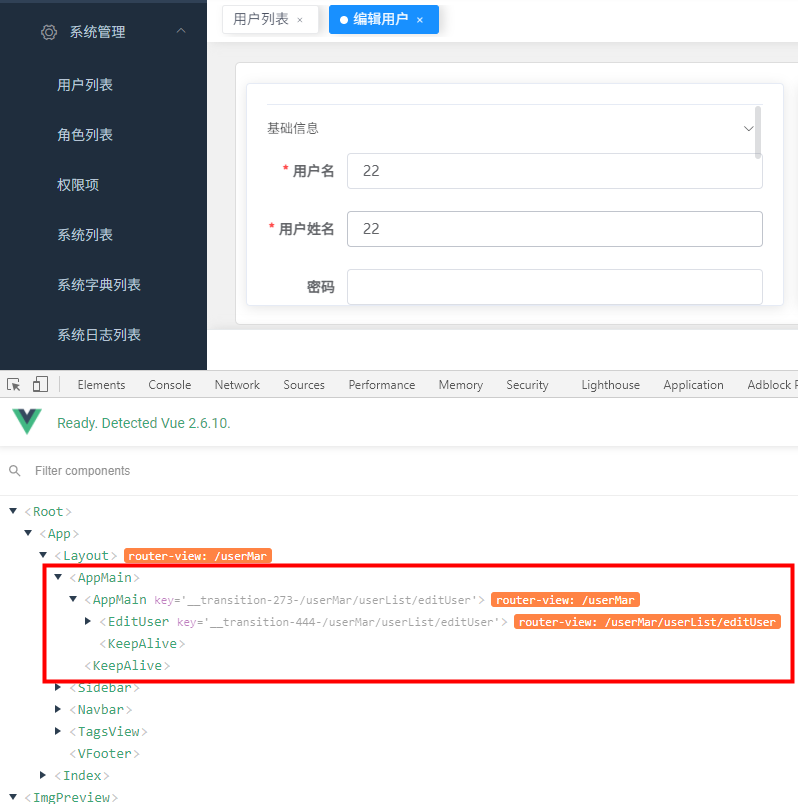
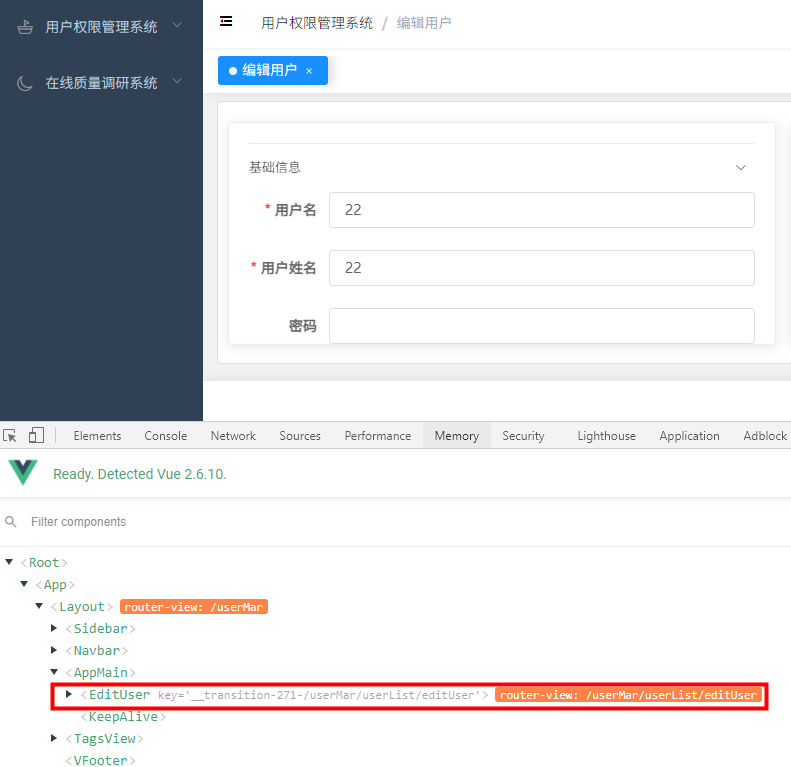

> 在多级路由中，如果使用`keep-alive`缓存页面，会出现缓存失效问题。

### 1、问题重现

在后台系统中，需要缓存`编辑用户`页面的数据，等到用户再此进入页面能够回显之前修改的数据。

这里如果直接使用 `keep-alive`，缓存是生效的，这时是对所有界面进行缓存，如果添加`include`后，缓存会失效

```vue
 <keep-alive :include="cachedViews">
        <router-view :key="key" />
 </keep-alive>
```



可以看到，组件`AppMain`重复显示了两次，形成路由嵌套，`keepAlive`只缓存到第一层，即`AppMain`组件，该组件只是一个`router-view`组件，缓存失效。

### 2、解决方案

这里再Vue的路由卫士里，将多余的`AppMain`组件直接删除，让业务组件直接拼在第一层的`AppMain`组件下，添加如下代码

```js
/**
 * 递归处理多余的 AppMain : <router-view>，
 * 让需要访问的组件保持在第一层 index : <router-view> 之下
 * @param to
 */
function handleKeepAlive(to) {
  if (to.matched && to.matched.length > 2) {
    for (let i = 0; i < to.matched.length; i++) {
      const element = to.matched[i]
      if (element.components.default.name === 'AppMain') {
        to.matched.splice(i, 1)
        handleKeepAlive(to)
      }
    }
  }
}

// 路由卫士
router.beforeEach(async(to, from, next) => {
    // 递归删除多余的AppMain
    handleKeepAlive(to)
})
```

删除后， `keep-alive`缓存生效，页面组件结构如下，

