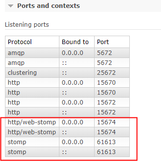
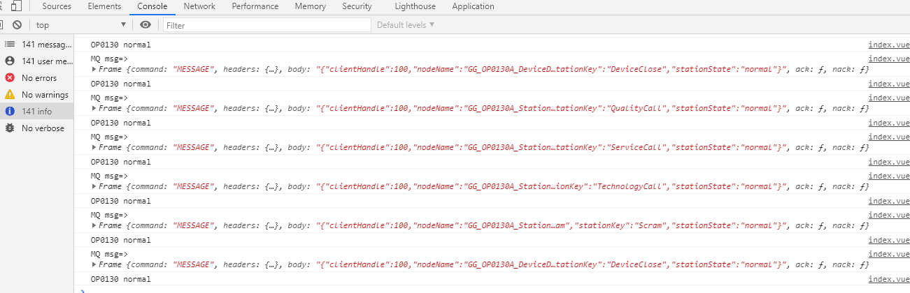

### 1、开启RabbitMQ的stomp系列插件

使用管理权限打开cmd，执行下列命令

```powershell
rabbitmq-plugins enable rabbitmq_management rabbitmq_web_stomp rabbitmq_stomp rabbitmq_web_stomp_examples
```


完成后，在rabbitMQ首页显示如下内容，如果没有显示，可以重新启动后会出现



### 2、vue 使用stompjs连接RabbitMQ

1. 安装stompjs

```spreadsheet
npm install stompjs@2.3.3
```

2. 创建mq连接工具常量配置`mqtt.js`

```js
// TODO mqtt服务配置
export const MQTT_SERVICE = process.env.VUE_APP_RABBITMQ_URL // mqtt服务地址
export const MQTT_USERNAME = process.env.VUE_APP_RABBITMQ_USERNAME // mqtt连接用户名
export const MQTT_PASSWORD = process.env.VUE_APP_RABBITMQ_PASSWORD // mqtt连接密码
```

根据vue的生产环境配置路径，这里以开发环境的配置文件`.env.development`为例配置地址

```vue
# RabbitMq服务地址
VUE_APP_RABBITMQ_URL = 'ws://127.0.0.1:15674/ws'
VUE_APP_RABBITMQ_USERNAME = 'guest'
VUE_APP_RABBITMQ_PASSWORD = 'guest'
```

3. 创建连接

```vue
<script>
    import Stomp from 'stompjs'
	import { MQTT_SERVICE, MQTT_USERNAME, MQTT_PASSWORD } from '@/utils/mqtt'
    export default {
  data() {
    return {
      topic: '/queue/agilefast_cloud.bigScreen.monitor',
      client: Stomp.client(MQTT_SERVICE)
      }
    }
  },
  created() {
    this.connect()
    // 是否开启控制台日志， 等于null表示关闭
    this.client.debug = null
  },
  methods: {
    onConnected: function(frame) {
      // 订阅频道
      this.client.subscribe(this.topic, this.responseCallback, this.onFailed)
    },
    onFailed: function(frame) {
      console.log('MQ Failed: ', frame)
    },
    responseCallback: function(frame) {
      // 接收消息处理
      // 消息格式定义
      // {"clientHandle":100,"nodeName":"GG_OP0130A_DeviceData_DeviceClose","stationKey":"DeviceClose","stationState":"fault"}
      console.log('MQ msg=>', frame)
      // 格式转换为json对象
      const res = JSON.parse(frame.body)
      
    },
    connect: function() {
      // 初始化mqtt客户端，并连接mqtt服务
      const headers = {
        login: MQTT_USERNAME,
        passcode: MQTT_PASSWORD,
        contentEncoding: 'base64'
      }
      this.client.connect(headers, this.onConnected, this.onFailed)
    }
  }
}
</script>
```

4. 连接验证

