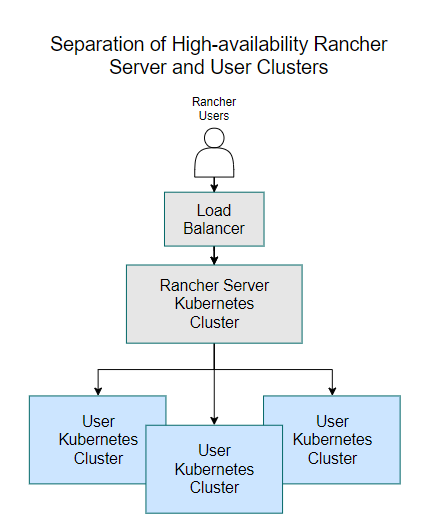
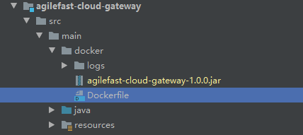
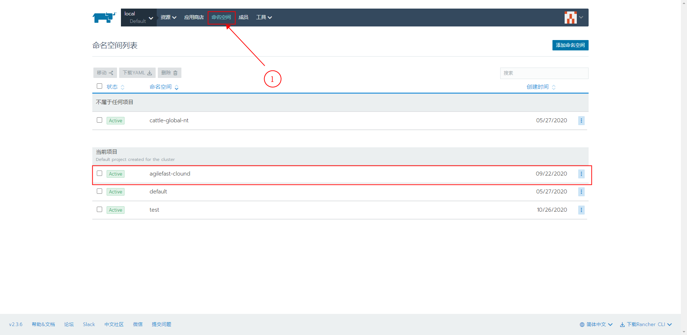
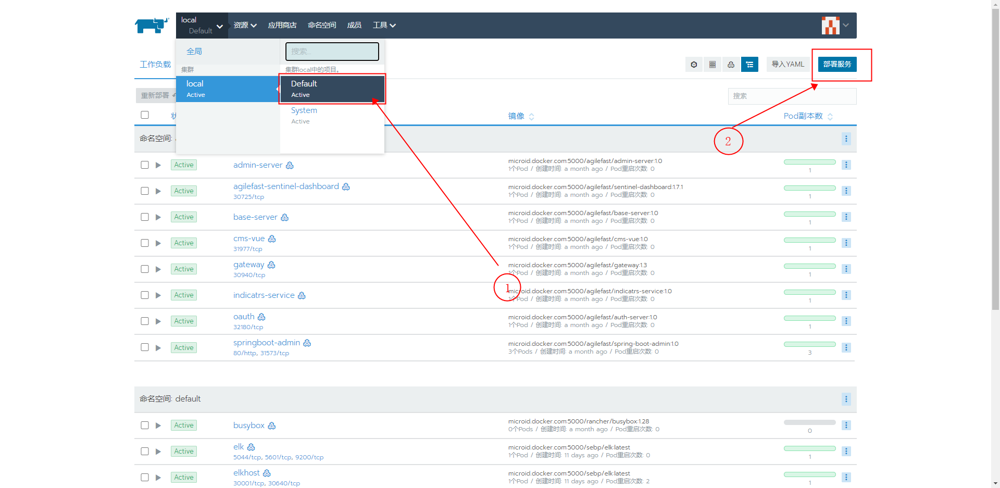
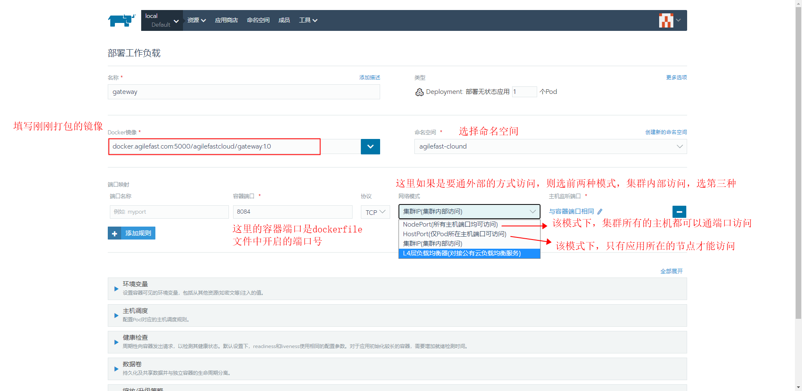
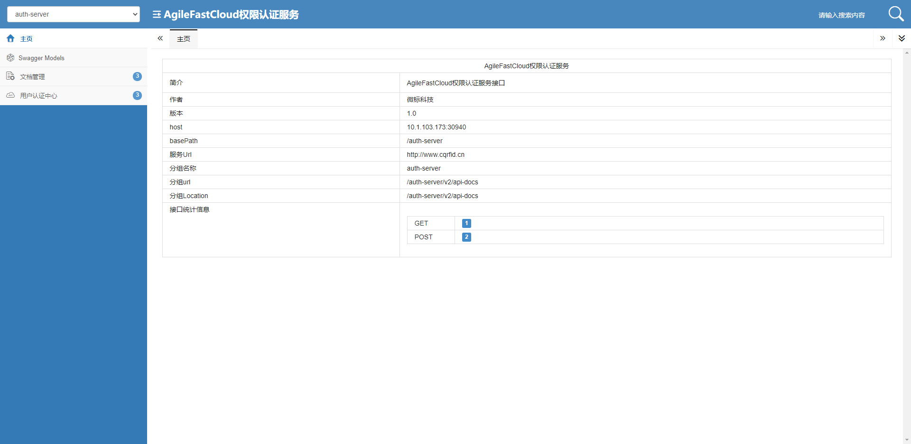

## CCR部署文档说明

ccr 部署采用Rancher + K3s的集群架构部署，该文档描述ccr生产环境的架构部署以及过程说明。

### 一、机器环境
<table>
	<tr>
		<th width=300>机器名称 </th>
		<th width=150>IP地址 </th>
		<th>描述 </th>
	</tr>
	<tr>
		<td>CCRNode1(CCR应用服务器1,Linux)</td>
		<td>10.107.250.92</td>
		<td rowspan="3">
        	部署Rancher+K3s集群，nacos集群必须需要三个机器才可以构成集群环境，这里用三台机器部署注册中心Nacos集群，所有的ccr应用服务部署在该集群中
        </td>
	</tr>
	<tr>
		<td>CCRNode2(CCR应用服务器2,Linux)</td>
		<td>10.107.250.93</td>
	</tr>
	<tr>
		<td>CCRNode3(CCR应用服务器3,Linux)</td>
		<td>10.107.250.113</td>
	</tr>
    <tr>
		<td>CCR应用服务器4,Linux</td>
		<td>10.107.250.114</td>
        <td>部署机器的负载均衡器，ntp时间同步服务器，docker私有仓库服务器</td>
	</tr>
    <tr>
		<td>CCR数据采集服务器,Windows</td>
		<td>10.107.250.94</td>
        <td>数据采集服务器，部署集群外部数据库MySql,集群DNS服务器</td>
	</tr>
    <tr>
		<td>CCR数据库服务器,Linux</td>
		<td>10.107.250.95</td>
        <td>ccr数据库服务器</td>
	</tr>
</table>

### 二、部署架构图

#### 1. Rancher+K3s高可用架构
   

#### 2. K3s 集群运行Rancher Management Server架构
   

#### 3. Rancher的四层负载均衡架构
   

### 三、部署流程

#### 1. 环境准备

参考[安装环境准备文档](./安装环境准备.md).

####  2. K3s部署

参考[K3s安装文档](./K3s安装.md).

#### 3. Rancher安装

参考[Rancher安装文档](./Rancher安装文档.md)

### 四、通过Rancher部署服务镜像

Rancher 部署应用的整体流程如下

```flow
开始=>start: 开始
结束=>end: 结束
过程1=>operation: 本地打包服务成jar包
过程2=>operation: 上传jar包和Dockerfile文件到指定服务器
制作镜像(build)=>operation: 制作镜像(build)
上传镜像到私有仓库(push)=>operation: 上传镜像到私有仓库(push)
Rancher部署镜像=>operation: Rancher部署镜像

开始->过程1(right)->过程2->制作镜像(right)->上传镜像到私有仓库(right)->Rancher部署镜像->结束
```

#### 1. 本地打包服务成jar包

可以单独打包，或直接打全量包

```shell
$ mvn clean package
```

#### 2. 上传jar包和Dockerfile文件到指定服务器

在每个服务的工程下都建有docker目录，里边有服务对应的`Dockerfile` 文件，文件内容如下

```dockerfile
# 设置基础镜像来源,注意，这里的基础镜像，由于公司内部集群的docker私有仓库和ccr生产的私有仓库地址有差异，所有在对应的环境下，建议检测修改
FROM microid.docker.com:5000/basejdk:8
# 维护者信息
MAINTAINER zhengyanxiong

# 设置环境变量
ENV JAVA_HOME /home/jdk8
ENV JRE_HOME $JAVA_HOME/jre
ENV CLASSPATH $JAVA_HOME/lib:$JAVA_HOME/bin:CLASSPATH
ENV PATH $JAVA_HOME/bin:$PATH

ENV PARAMS=""

# 设置时区
ENV TZ=PRC
RUN ln -snf /usr/share/zoneinfo/$TZ /etc/localtime && echo $TZ > /etc/timezone

# 将当前jar包拷贝到home下的工作目录
COPY agilefast-cloud-gateway-1.0.0.jar /home/gateway/agilefast-cloud-gateway-1.0.0.jar

# 设置jar包的操作权限
RUN chmod -R 777 /home/gateway/agilefast-cloud-gateway-1.0.0.jar

# 设置工作目录
WORKDIR /home

# 开放的端口
EXPOSE 8084

# 启动命令
# CMD ["java","-jar","/home/gateway/agilefast-cloud-gateway-1.0.0.jar"]
ENTRYPOINT ["sh","-c","java $PARAMS -jar /home/gateway/agilefast-cloud-gateway-1.0.0.jar"]

```

   

#### 3. 制作镜像

进入到上一步上传的文件目录下，执行命令`docker build -t <私有镜像仓库地址:5000>/<镜像名称>:<镜像版本号> .`

```sh
$ docker build -t docker.agilefast.com:5000/agilefastcloud/gateway:1.0 . # 注意，不能忘了后边的 . 号
```

#### 4. 上传镜像

完成上一步后，执行命令`docker push <镜像名称>`

```sh
$ docker push docker.agilefast.com:5000/agilefastcloud/gateway:1.0
```

#### 5. Rancher部署镜像

1. 为K3s 设置不同的命名空间，部署对应的项目，如下图按照默认配置添加名为`agilefast-cloud` 命名空间

   

2. 按照下面步骤到部署页面

   

3. 部署应用

   

4. 如果没问题的话😂，就会看到下图的样子有

   

   点击30940即可访问页面

   

到此应用部署完成🤞🤞🤞🤞🤞